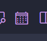
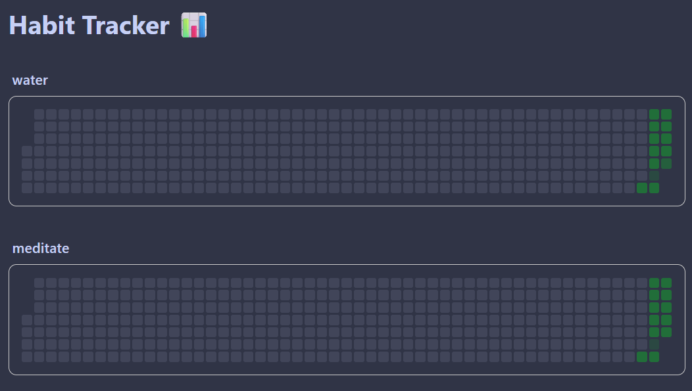
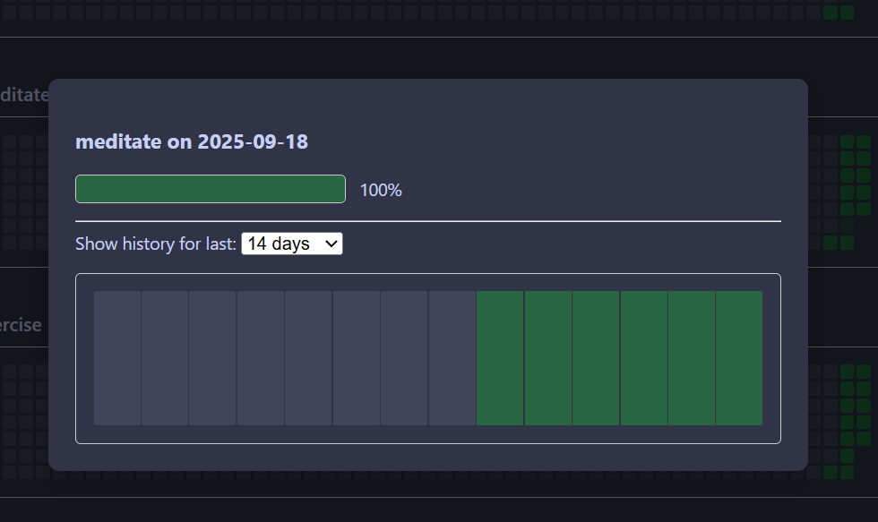

# Habit Tracker Extension

A VS Code extension to graph your habits from daily notes.

This extension was tested with the [Foam](https://github.com/foambubble/foam) extension for VS Code, but it should work with any system where you create daily notes in Markdown.

The extension scans your workspace for Markdown files (`.md`) that are named with a date prefix in the format `YYYY-MM-DD` (e.g., `2025-09-25-daily-note.md`). It then looks for habit tracking syntax within those files in the following formats:

-   `&habit` (for a completed habit)
-   `&habit(value/goal)` (for a fractional habit, like `&water(3/8)`)

## Features

*   **Visualize Your Habits:** See your progress with a beautiful graph.
*   **Workspace-Wide Scanning:** Automatically finds and processes your habit notes from anywhere in your open workspace.
*   **Markdown-Friendly:** Integrates with your existing Markdown-based note-taking workflow.

## Usage

1.  **Track Your Habits:**
    *   In your daily note files (e.g., `2025-09-25.md`), use the following syntax to track your habits:
        *   `&habitname` - Marks a habit as fully completed (e.g., `&exercise`).
        *   `&habitname(value/goal)` - Tracks a fractional habit (e.g., `&water(6/8)`).
        *   `&habitname(#)` - An alternative syntax for a completed habit (e.g., `&meditate(1)`).

2.  **Open the Habit Tracker:**
    *   Open the Command Palette (Ctrl+Shift+P).
    *   Run the `Habit Tracker: Show` command.
    *   Alternatively, when viewing a Markdown file, click the calendar icon in the editor title bar.

## Screenshots

*icon to launch the habit tracker*

*Main view of the habit tracker, showing a graph of your habits over time.*

*Detail view for a specific day, showing the habits tracked in that day's note.*

## Release Notes

For a full list of changes, please see the [CHANGELOG.md](CHANGELOG.md) file.

### 0.5.0

- Reverted to the old calendar icon.
- Updated the extension icon.
- Updated the SVG icon to use VS Code theme colors.
- Added screenshots to `README.md`.
- Updated `README.md` with detailed usage instructions on how to track habits.
- Automated the VSIX extension file generation as part of the `npm run package` script.
- Updated `README.md` to be more accurate and descriptive.
- Removed unused dependencies (`@types/mocha`, `@vscode/test-electron`).
- Removed the unimplemented `habitTracker.notesFolder` setting.
- Renamed the default branch from `master` to `main`.